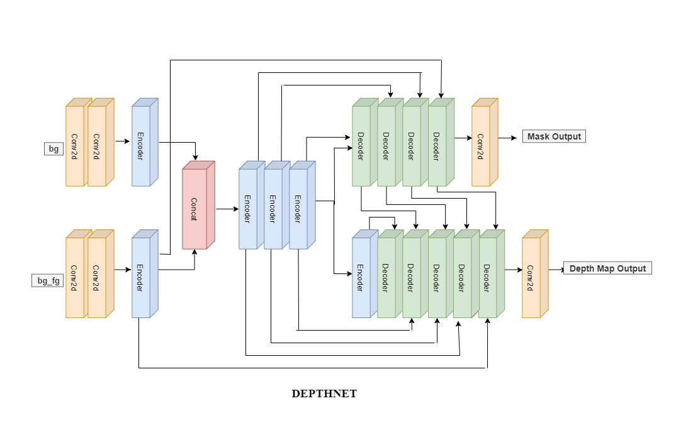

# Monocular Depth Estimation

Depth estimation is a computer vision task designed to estimate depth from a 2D image. Depth information is important for autonomous systems to perceive environments and estimate their own state.  The depth image includes information about the distance of the objects in the image from the viewpoint, which is usually the camera taking the image.

|                 Segmentation Masks             |                 Depth Map                    | 
| :--------------------------------------------: | :------------------------------------------: |
|                   |               | 

In this project I made a DepthNet Architecture which takes background and a background-foreground image as input and produces their corresponding depth mappings and segmentation masks of the forground.

The project is divided into two segments focusing on the two different outputs of the model. The first one being MaskNet:

 
[](https://colab.research.google.com/drive/11drXRdxWF1AFUgtp-0ybKsTYfiHCLsFU?usp=sharing)    


## MaskNet


The motive of this architecture is to produce Segmentation masks of the given image.

<p align="center">
      
</p>

A image is a matrix for the computer and in this particular image we require only two pixel values, i.e., 0(Black) and 1(White). We know the power of deep learning, it is a machine learning technique that teaches computers to do what comes naturally to humans: learn by example. Deep learning is a key technology behind driverless cars, it is the key to voice control in consumer devices like phones, tablets, TVs, and hands-free speakers. Deep learning is getting lots of attention lately and for good reason. It’s achieving results that were not possible before.

So we now know that predicting two different numbers won't be that difficult for a model to learn.

Taking this into consideration I created a pretty small fully convolutional network for MaskNet which takes background and a background-foreground image as input and outputs segmentation masks of the forground.

<p align="center"></p>

### MaskNet Summary

```
----------------------------------------------------------------
        Layer (type)               Output Shape         Param #
================================================================
            Conv2d-1         [-1, 32, 224, 224]             896
       BatchNorm2d-2         [-1, 32, 224, 224]              64
              ReLU-3         [-1, 32, 224, 224]               0
            Conv2d-4         [-1, 32, 224, 224]             896
       BatchNorm2d-5         [-1, 32, 224, 224]              64
              ReLU-6         [-1, 32, 224, 224]               0
            Conv2d-7         [-1, 64, 224, 224]          36,928
       BatchNorm2d-8         [-1, 64, 224, 224]             128
              ReLU-9         [-1, 64, 224, 224]               0
           Conv2d-10         [-1, 64, 224, 224]          36,928
      BatchNorm2d-11         [-1, 64, 224, 224]             128
             ReLU-12         [-1, 64, 224, 224]               0
           Conv2d-13          [-1, 1, 224, 224]              65
         MaskNet3-14          [-1, 1, 224, 224]               0
================================================================
Total params: 76,097
Trainable params: 76,097
Non-trainable params: 0
----------------------------------------------------------------
Input size (MB): 86436.00
Forward/backward pass size (MB): 221.27
Params size (MB): 0.29
Estimated Total Size (MB): 86657.55
----------------------------------------------------------------
```

The code for MaskNet can be seen [here](deepnet/model/models/masknet.py)

[](https://colab.research.google.com/drive/1BFIp-rdOjE4C-PcV6Jm_A7F4NuQRIhj_?usp=sharing)  

## DepthNet  
<p align='center'>
     
</p>
### Architecture
In the architecture **bg** denotes the background image and **bg_fg** denotes background-foreground image. DepthNet follows a encoder-decoder model, since we want images as an output, we convolve the images to get the features by encoding and then convolve up, namely `UpSample`, decoding the image to reach it's initial dimension.




The model is fully convolutional and includes efficient residual up-sampling blocks — decoder — that track high-dimensional regression problems.   
The first section of the network is proprietary for combining the the inputs together by concatenating them. The second part is a sequence of convolutional and interpolate layers that guide the network in learning its upscaling. In the end a final convolution is applied that yeilds the final predictions. 


### Approach for DepthNet

The encoding for **Segmentation masks** is stopped early than Depth Maps, as I understood that there is no need for masks to undergo a deep network. Also as evident from the architecture the output from decoder of segmentation masks is being fed to decoder of Depth Maps, because masks stores the location of the foreground that can help decoder of Depth Maps to yeild better predictions .

### DepthNet Result
|                 IOU                            |                 Validation Loss              | 
| :--------------------------------------------: | :------------------------------------------: |
|              |            |

### Predictions

  

### DepthNet Summary

```
----------------------------------------------------------------
        Layer (type)               Output Shape         Param #
================================================================
            Conv2d-1         [-1, 16, 224, 224]             448
       BatchNorm2d-2         [-1, 16, 224, 224]              32
              ReLU-3         [-1, 16, 224, 224]               0
            Conv2d-4         [-1, 16, 224, 224]           2,320
       BatchNorm2d-5         [-1, 16, 224, 224]              32
              ReLU-6         [-1, 16, 224, 224]               0
            Conv2d-7         [-1, 16, 224, 224]             448
       BatchNorm2d-8         [-1, 16, 224, 224]              32
              ReLU-9         [-1, 16, 224, 224]               0
           Conv2d-10         [-1, 16, 224, 224]           2,320
      BatchNorm2d-11         [-1, 16, 224, 224]              32
             ReLU-12         [-1, 16, 224, 224]               0
        MaxPool2d-13         [-1, 16, 112, 112]               0
           Conv2d-14         [-1, 16, 112, 112]           2,320
      BatchNorm2d-15         [-1, 16, 112, 112]              32
             ReLU-16         [-1, 16, 112, 112]               0
           Conv2d-17         [-1, 16, 112, 112]           2,320
      BatchNorm2d-18         [-1, 16, 112, 112]              32
             ReLU-19         [-1, 16, 112, 112]               0
           Conv2d-20         [-1, 16, 112, 112]             256
      BatchNorm2d-21         [-1, 16, 112, 112]              32
          Encoder-22         [-1, 16, 112, 112]               0
        MaxPool2d-23         [-1, 16, 112, 112]               0
           Conv2d-24         [-1, 16, 112, 112]           2,320
      BatchNorm2d-25         [-1, 16, 112, 112]              32
             ReLU-26         [-1, 16, 112, 112]               0
           Conv2d-27         [-1, 16, 112, 112]           2,320
      BatchNorm2d-28         [-1, 16, 112, 112]              32
             ReLU-29         [-1, 16, 112, 112]               0
           Conv2d-30         [-1, 16, 112, 112]             256
      BatchNorm2d-31         [-1, 16, 112, 112]              32
          Encoder-32         [-1, 16, 112, 112]               0
        MaxPool2d-33           [-1, 32, 56, 56]               0
           Conv2d-34           [-1, 64, 56, 56]          18,496
      BatchNorm2d-35           [-1, 64, 56, 56]             128
             ReLU-36           [-1, 64, 56, 56]               0
           Conv2d-37           [-1, 64, 56, 56]          36,928
      BatchNorm2d-38           [-1, 64, 56, 56]             128
             ReLU-39           [-1, 64, 56, 56]               0
           Conv2d-40           [-1, 64, 56, 56]           2,048
      BatchNorm2d-41           [-1, 64, 56, 56]             128
          Encoder-42           [-1, 64, 56, 56]               0
        MaxPool2d-43           [-1, 64, 28, 28]               0
           Conv2d-44          [-1, 128, 28, 28]          73,856
      BatchNorm2d-45          [-1, 128, 28, 28]             256
             ReLU-46          [-1, 128, 28, 28]               0
           Conv2d-47          [-1, 128, 28, 28]         147,584
      BatchNorm2d-48          [-1, 128, 28, 28]             256
             ReLU-49          [-1, 128, 28, 28]               0
           Conv2d-50          [-1, 128, 28, 28]           8,192
      BatchNorm2d-51          [-1, 128, 28, 28]             256
          Encoder-52          [-1, 128, 28, 28]               0
        MaxPool2d-53          [-1, 128, 14, 14]               0
           Conv2d-54          [-1, 256, 14, 14]         295,168
      BatchNorm2d-55          [-1, 256, 14, 14]             512
             ReLU-56          [-1, 256, 14, 14]               0
           Conv2d-57          [-1, 256, 14, 14]         590,080
      BatchNorm2d-58          [-1, 256, 14, 14]             512
             ReLU-59          [-1, 256, 14, 14]               0
           Conv2d-60          [-1, 256, 14, 14]          32,768
      BatchNorm2d-61          [-1, 256, 14, 14]             512
          Encoder-62          [-1, 256, 14, 14]               0
           Conv2d-63          [-1, 128, 14, 14]          32,896
           Conv2d-64          [-1, 128, 28, 28]         147,584
      BatchNorm2d-65          [-1, 128, 28, 28]             256
             ReLU-66          [-1, 128, 28, 28]               0
           Conv2d-67          [-1, 128, 28, 28]         147,584
      BatchNorm2d-68          [-1, 128, 28, 28]             256
             ReLU-69          [-1, 128, 28, 28]               0
          Decoder-70          [-1, 128, 28, 28]               0
           Conv2d-71           [-1, 64, 28, 28]           8,256
           Conv2d-72           [-1, 64, 56, 56]          36,928
      BatchNorm2d-73           [-1, 64, 56, 56]             128
             ReLU-74           [-1, 64, 56, 56]               0
           Conv2d-75           [-1, 64, 56, 56]          36,928
      BatchNorm2d-76           [-1, 64, 56, 56]             128
             ReLU-77           [-1, 64, 56, 56]               0
          Decoder-78           [-1, 64, 56, 56]               0
           Conv2d-79           [-1, 32, 56, 56]           2,080
           Conv2d-80         [-1, 32, 112, 112]           9,248
      BatchNorm2d-81         [-1, 32, 112, 112]              64
             ReLU-82         [-1, 32, 112, 112]               0
           Conv2d-83         [-1, 32, 112, 112]           9,248
      BatchNorm2d-84         [-1, 32, 112, 112]              64
             ReLU-85         [-1, 32, 112, 112]               0
          Decoder-86         [-1, 32, 112, 112]               0
           Conv2d-87         [-1, 16, 112, 112]             528
           Conv2d-88         [-1, 16, 224, 224]           2,320
      BatchNorm2d-89         [-1, 16, 224, 224]              32
             ReLU-90         [-1, 16, 224, 224]               0
           Conv2d-91         [-1, 16, 224, 224]           2,320
      BatchNorm2d-92         [-1, 16, 224, 224]              32
             ReLU-93         [-1, 16, 224, 224]               0
          Decoder-94         [-1, 16, 224, 224]               0
           Conv2d-95          [-1, 1, 224, 224]              17
        MaxPool2d-96            [-1, 256, 7, 7]               0
           Conv2d-97            [-1, 512, 7, 7]       1,180,160
      BatchNorm2d-98            [-1, 512, 7, 7]           1,024
             ReLU-99            [-1, 512, 7, 7]               0
          Conv2d-100            [-1, 512, 7, 7]       2,359,808
     BatchNorm2d-101            [-1, 512, 7, 7]           1,024
            ReLU-102            [-1, 512, 7, 7]               0
          Conv2d-103            [-1, 512, 7, 7]         131,072
     BatchNorm2d-104            [-1, 512, 7, 7]           1,024
         Encoder-105            [-1, 512, 7, 7]               0
          Conv2d-106            [-1, 256, 7, 7]         131,328
          Conv2d-107          [-1, 256, 14, 14]         590,080
     BatchNorm2d-108          [-1, 256, 14, 14]             512
            ReLU-109          [-1, 256, 14, 14]               0
          Conv2d-110          [-1, 256, 14, 14]         590,080
     BatchNorm2d-111          [-1, 256, 14, 14]             512
            ReLU-112          [-1, 256, 14, 14]               0
         Decoder-113          [-1, 256, 14, 14]               0
          Conv2d-114          [-1, 128, 14, 14]          32,896
          Conv2d-115          [-1, 128, 28, 28]         147,584
     BatchNorm2d-116          [-1, 128, 28, 28]             256
            ReLU-117          [-1, 128, 28, 28]               0
          Conv2d-118          [-1, 128, 28, 28]         147,584
     BatchNorm2d-119          [-1, 128, 28, 28]             256
            ReLU-120          [-1, 128, 28, 28]               0
         Decoder-121          [-1, 128, 28, 28]               0
          Conv2d-122           [-1, 64, 28, 28]           8,256
          Conv2d-123           [-1, 64, 56, 56]          36,928
     BatchNorm2d-124           [-1, 64, 56, 56]             128
            ReLU-125           [-1, 64, 56, 56]               0
          Conv2d-126           [-1, 64, 56, 56]          36,928
     BatchNorm2d-127           [-1, 64, 56, 56]             128
            ReLU-128           [-1, 64, 56, 56]               0
         Decoder-129           [-1, 64, 56, 56]               0
          Conv2d-130           [-1, 32, 56, 56]           2,080
          Conv2d-131         [-1, 32, 112, 112]           9,248
     BatchNorm2d-132         [-1, 32, 112, 112]              64
            ReLU-133         [-1, 32, 112, 112]               0
          Conv2d-134         [-1, 32, 112, 112]           9,248
     BatchNorm2d-135         [-1, 32, 112, 112]              64
            ReLU-136         [-1, 32, 112, 112]               0
         Decoder-137         [-1, 32, 112, 112]               0
          Conv2d-138         [-1, 16, 112, 112]             528
          Conv2d-139         [-1, 16, 224, 224]           2,320
     BatchNorm2d-140         [-1, 16, 224, 224]              32
            ReLU-141         [-1, 16, 224, 224]               0
          Conv2d-142         [-1, 16, 224, 224]           2,320
     BatchNorm2d-143         [-1, 16, 224, 224]              32
            ReLU-144         [-1, 16, 224, 224]               0
         Decoder-145         [-1, 16, 224, 224]               0
          Conv2d-146          [-1, 1, 224, 224]              17
   DepthMaskNet8-147  [[-1, 1, 224, 224], [-1, 1, 224, 224]]               0
================================================================
Total params: 7,083,874
Trainable params: 7,083,874
Non-trainable params: 0
----------------------------------------------------------------
Input size (MB): 86436.00
Forward/backward pass size (MB): 18906.54
Params size (MB): 27.02
Estimated Total Size (MB): 105369.56
----------------------------------------------------------------
```

The code for DepthNet can be seen [here](deepnet/model/models/depthnet.py)

## Parameters and Hyperparameters

- Loss Function: BCE-RMSE Loss (combination of `nn.BCEWithLogitsLoss` and `Root Mean Square Loss`)
- Optimizer: SGD
- Learning Rate: 0.1
- Number of epochs: 12
- Comparison Metric: Loss
- Momentum: 0.9
- L2 regularization factor: 1e-8


## Dataset Preparation
 The dataset consist of 400000 **bg_fg**, 400000 **bg_fg_masks** which are segmentation masks of te foreground and 400000 **bg_fg_depth** which are depth estimation maps and 100 different **bg** and 100 different **fg** on which the whole dataset is created.
 The complete procedure of dataset preparation is explained [here](https://github.com/rvk007/MODEST-Museum-Dataset).


## Data Augmentation

Image data is encoded into 3 stacked matrices, each of size height×width. These matrices represent pixel values for an individual RGB color value. Lighting biases are amongst
the most frequently occurring challenges to image recognition problems. Therefore, the efectiveness of color space transformations, also known as `photometric transformations`. I applied the below transformations.
- HueSaturationValue
- RandomBrightnessContrast

`HueSaturationValue`, it changes the brilliance and intensity of a color and `RandomBrightnessContrast` as the name suggests it randomly changes the brightness and contrast of the image. Since they depict the real world scenario, I chose them as augmentations for the dataset.

## Loss Functions

### BCEWithLogitsLoss
Binary Cross Entropy with Logits Loss, is used for binary classification, since the segmentation masks and depth also consist of two pixel 0 and 1, the above loss can be used.

### Root Mean Square Loss
RMSE is a quadratic scoring rule that also measures the average magnitude of the error. It’s the square root of the average of squared 
differences between prediction and actual observation.
RMSE does not necessarily increase with the variance of the errors. RMSE increases with the variance of the frequency distribution of error magnitudes.

### SSIM  
Structural SIMilarity is a image assessment algorithm. It analyse the pair of images as perceived by a human for which it takes the three major aspect for comparison:
- Change in luminance, which compares the brightness of the two images.
- Change in contrast, which looks for differences in the range between the brightest and darkest extent of the two images.
- Correlation, which compares the fundamental structure.

It scales the two images to same size and resolution for a pixel-by-pixel comparison. This provides a big advance over MSE(Mean Square Error) and PSNR (Peak Signal to Noise Ratio).

### Dice Loss
`DiceLoss = 1 - Dice Coefficient`  
Dice coefficient, which is essentially a measure of overlap between two samples measure ranges from 0 to 1 where a Dice coefficient of 1 denotes perfect and complete overlap.
Because our target mask is binary, we effectively zero-out any pixels from our prediction which are not "activated" in the target mask. For the remaining pixels, we are essentially penalizing low-confidence predictions; a higher value for this expression, which is in the numerator, leads to a better Dice coefficient.

As these losses are very efficient, I also combined them during prediction of DepthNet. You can see all the applied combinations [here](deepnet/model/losses).

Following is the behaviour of some of the combination of loss functions:

### Results
|                 IOU                            |                 Validation Loss              | RMSE                                       |
| :--------------------------------------------: | :------------------------------------------: |:------------------------------------------:|
|              |            |          |


### Experiments
To look at the all experiments I have performed, go [here](deepnet/experiments)

## Project Setup

### On Local System

Install the required packages  
 `$ pip install -r requirements.txt`

### On Google Colab

Upload the files in the root folder and select Python 3 as the runtime type and GPU as the harware accelerator.

